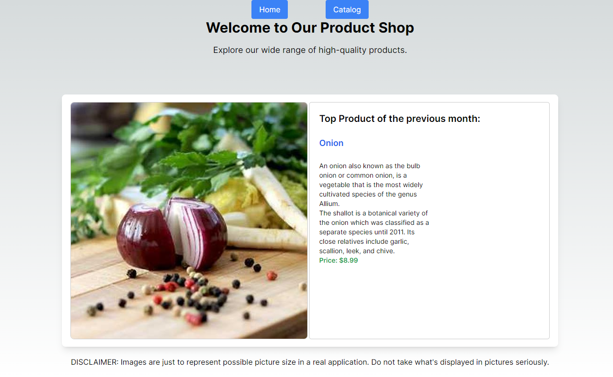
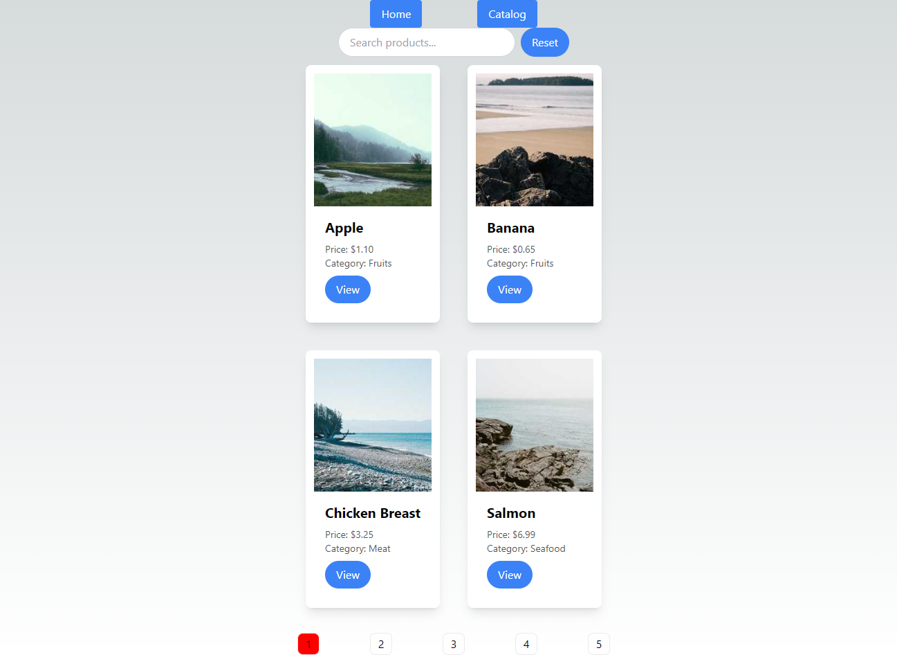
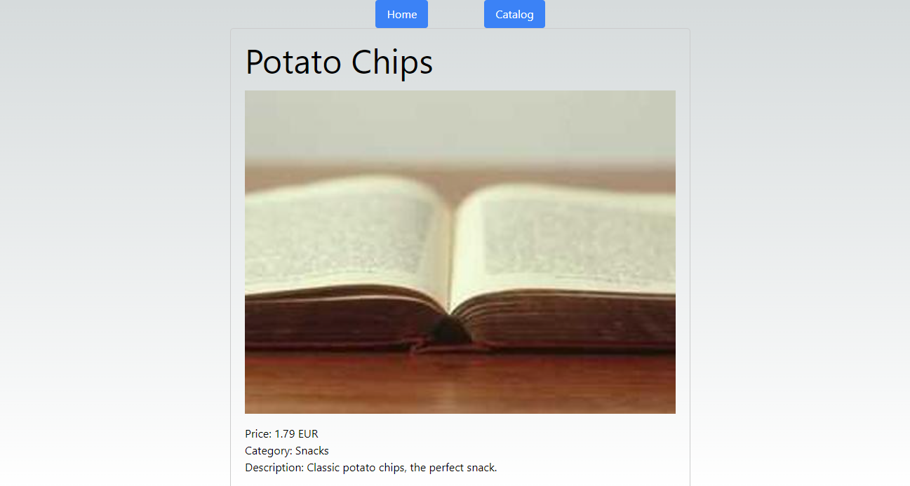
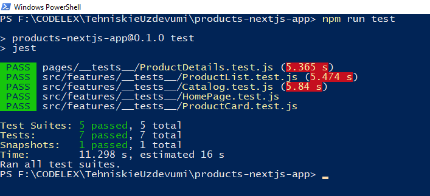

Simple NextJS App. That is fetching **Product[]** from https://run.mocky.io/v3/b54fe93f-f5a1-426b-a76c-e43d246901fd

```
Product {
  id: number;
  name: string;
  price: number;
  currency: string;
  category: string;
  description: string;
}
```

Home page: http://localhost:3000



Catalog: http://localhost:3000/products



Product details: http://localhost:3000/products/14



## How to run tests

In 'products-nextjs-app' folder open terminal or powershell and type: 'npm run test'



## Code from other sources

Axios inside agent.ts (products-nextjs-app/src/app/api/agent.ts)

- https://www.udemy.com/course/learn-to-build-an-e-commerce-store-with-dotnet-react-redux/

Debounce:

- https://stackoverflow.com/questions/42217121/how-to-start-search-only-when-user-stops-typing

Pagination:

- https://blog.logrocket.com/add-pagination-next-js-app/

Tests:

- https://www.youtube.com/watch?v=ML5egqL3YFE (React Testing Tutorial (Jest + React Testing Library))
- https://fek.io/blog/add-jest-testing-framework-to-an-existing-next-js-app/

## This is a [Next.js](https://nextjs.org/) project

It is bootstrapped with [`create-next-app`](https://github.com/vercel/next.js/tree/canary/packages/create-next-app).

## Getting Started

First, run the development server:

```bash
npm run dev
# or
yarn dev
# or
pnpm dev
# or
bun dev
```

Open [http://localhost:3000](http://localhost:3000) with your browser to see the result.

You can start editing the page by modifying `app/page.tsx`. The page auto-updates as you edit the file.

This project uses [`next/font`](https://nextjs.org/docs/basic-features/font-optimization) to automatically optimize and load Inter, a custom Google Font.

## Learn More

To learn more about Next.js, take a look at the following resources:

- [Next.js Documentation](https://nextjs.org/docs) - learn about Next.js features and API.
- [Learn Next.js](https://nextjs.org/learn) - an interactive Next.js tutorial.

You can check out [the Next.js GitHub repository](https://github.com/vercel/next.js/) - your feedback and contributions are welcome!

## Deploy on Vercel

The easiest way to deploy your Next.js app is to use the [Vercel Platform](https://vercel.com/new?utm_medium=default-template&filter=next.js&utm_source=create-next-app&utm_campaign=create-next-app-readme) from the creators of Next.js.

Check out our [Next.js deployment documentation](https://nextjs.org/docs/deployment) for more details.
